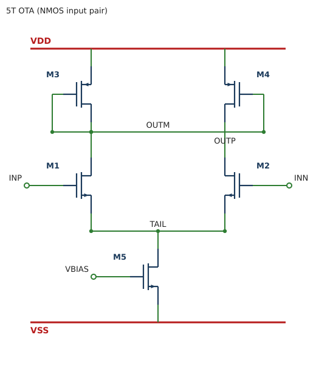

# netlist → SVG/HTML 변환기 (analog schematic auto-placement)

SPICE netlist 를 입력받아 **배치 규칙(placement rules)** 을 적용하고
회로도(schematic)를 **HTML / SVG** 로 그려주는 순수 Python 도구입니다. 외부 의존성 없음.

```
# HTML (기본) — 회로도 + 컴포넌트 라이브러리 패널
python -m netlist_svg examples/ota_5t.sp -o examples/ota_5t.html

# SVG 만
python -m netlist_svg examples/ota_5t.sp -f svg -o examples/ota_5t.svg
```

결과 예시 — 5-트랜지스터 OTA (NMOS 입력쌍, R+diode 바이어스):



## 심볼 라이브러리 (점점 추가 중)

| 심볼 | netlist prefix | 상태 |
|------|----------------|------|
| NMOS / PMOS | `M` | ✅ |
| Resistor    | `R` | ✅ |

> 전류원/바이어스는 **diode-connected NMOS** (gate를 drain에 묶은 `M`) 로 구성합니다.

## 구조

| 파일 | 역할 |
|------|------|
| `netlist_svg/parser.py`        | SPICE netlist 파싱 → `Device` / `Netlist` (mos/res/diode) |
| `netlist_svg/placer.py`        | **배치 규칙** : net 전압 레벨링 + 컬럼 할당 |
| `netlist_svg/symbols.py`       | 심볼 라이브러리(SVG): mosfet / resistor / diode |
| `netlist_svg/renderer.py`      | 배치 결과 → 와이어 라우팅 + SVG 출력 |
| `netlist_svg/html_renderer.py` | SVG + 컴포넌트 라이브러리 패널을 HTML 로 래핑 |
| `examples/ota_5t.sp`           | 5T OTA 예제 netlist |

## 배치 규칙 (GUI placement rules)

1. **레일(rail)** — 이름이 양전원(VDD/VCC) 같으면 맨 위로, 접지(VSS/GND/0)는 맨
   아래로 고정. 가로 버스로 그림.
2. **전압 레벨링** — 각 소자는 drain/source net 사이에 상하 순서를 부여한다.
   PMOS 는 *source* 가 *drain* 보다 위(VDD 쪽), NMOS 는 *drain* 이 *source* 보다
   위. 이 방향 그래프에서 longest-path 로 각 net 의 세로 레벨을 계산 → 회로가
   VDD(위) → VSS(아래) 로 흐른다.
3. **행(row)** — 소자는 자기 두 전원 단자 net 레벨 사이 밴드에 배치 → 직렬로
   쌓인 소자는 세로로 정렬된다.
4. **열(column)** — 신호 net 으로 직렬 연결된 소자는 같은 열을 공유한다(차동 구조는
   좌우 대칭으로 배치). 3개 이상 소자가 만나는 노드(예: tail)는 공유 버스로 보고
   체이닝에서 제외 → 단일 소자(tail 전류원)는 가운데로 정렬.
5. **라우팅** — net 마다 가로 트렁크를 두고 단자를 직각(Manhattan)으로 연결.
   같은 레벨의 서로 다른 신호 net 은 세로로 살짝 오프셋해 겹침(가짜 단락)을 방지.
   3핀 이상 연결부에는 junction dot 을 찍는다.

## netlist 문법

```
M<name> <drain> <gate> <source> <bulk> <model> [W=.. L=..]
R<name> <n1> <n2> <value>
.model <name> <nmos|pmos>
```

diode-connected NMOS 는 그냥 gate 를 drain 에 묶으면 됩니다:
`MB1 VBIAS VBIAS VSS VSS nmos`

- `*` 주석, `+` 연속줄 지원
- gate 에만 연결되고 drain/source 에 안 나타나는 신호 net 은 외부 입력 포트로 그림
  (예: `INP`, `INN`, `VBIAS`)
