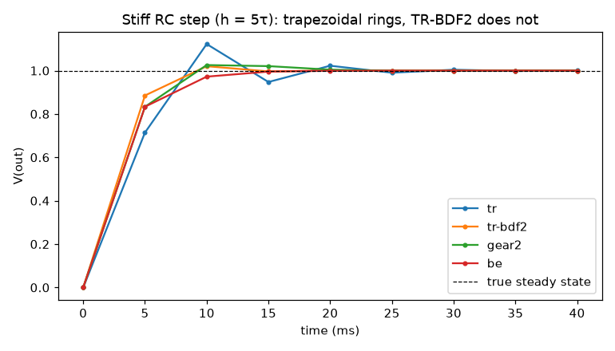

# FastSpice — 더 빠르고 더 정확한 SPICE 엔진 프로토타입

ngspice(Berkeley SPICE 계열)의 **계산 속도와 정확도를 동시에** 끌어올리는
방법론을 정리하고, 그 방법론을 실제로 구현·검증한 회로 시뮬레이션 엔진이다.
모든 정확도 주장은 해석해(closed-form)와 비교한 측정값으로 뒷받침된다.

> 방법론 전문: [`docs/METHODOLOGY.md`](docs/METHODOLOGY.md)

## 핵심 아이디어

정확도와 속도는 상충하지 않는다 — **더 정확한 적분기는 같은 오차를 더 큰
스텝으로 달성**하므로 더 빠르고, **더 강건한 Newton은 재시도를 줄여** 더 빠르다.

| 축 | ngspice 기본 | FastSpice | 효과 |
|----|------|-----------|------|
| 적분기 | 사다리꼴(TR) / Gear | **TR-BDF2** (L-안정, 2차) | 트래피조이덜 링잉 제거 + 2차 정확도 |
| 스텝 제어 | 보수적 LTE | **3차 분할차분 LTE + PI 제어** | 스텝 8~25배 감소 |
| 선형 솔버 | Sparse1.3 | **KLU 형 심볼릭 재사용** 인터페이스 | 반복 분해 비용 절감 |
| 비선형 수렴 | 한정 limiting | **리미팅 + gmin/소스 스테핑 호모토피** | 콜드 스타트 수렴 |

## 측정 결과 (`python benchmarks/run_benchmarks.py`)

```
[1] 수렴 차수    BE 1.00 | TR 2.00 | Gear2 1.95 | TR-BDF2 2.00     (이론값 일치)
[2] 거짓 진동    TR 0.122  →  TR-BDF2 0.020                        (≈6배 감소)
[3] 적응 효율    고정 4000스텝  →  적응 159~493스텝                (8~25배 적은 스텝)
[4] 비선형       다이오드 정류기 수렴 (호모토피 + 접합 리미팅)
```



*stiff RC 계단 응답(h=5τ): 사다리꼴(TR)은 참값 1.0 주위로 거짓 진동, TR-BDF2는
즉시 안정. 둘 다 2차 정확도지만 TR-BDF2만 L-안정.*

## 빠른 시작

```bash
pip install numpy scipy            # (그림은 matplotlib 추가)

# 넷리스트 실행
python -m fastspice examples/rectifier.cir --print out

# 벤치마크 + 그림
python benchmarks/run_benchmarks.py --plot

# 검증 테스트 (해석해 대비)
python tests/test_fastspice.py
```

### 파이썬 API

```python
from fastspice import parse_netlist, transient

c, tran = parse_netlist("""RC low-pass
V1 in 0 SIN(0 1 1000)
R1 in out 1k
C1 out 0 1u
.tran 5u 5m
.end""")

res = transient(c, tran["tstop"], tran["tstep"], integrator="tr-bdf2")
print(res.stats)          # 스텝 수 / Newton 반복 / 기각 수
vout = res.v("out")       # 출력 노드 파형
```

## 구조

```
fastspice/
  parser.py       SPICE 넷리스트 파서 (R C L V I D, PULSE/SIN, .tran/.model)
  circuit.py      MNA 인덱싱 + 희소 조립
  devices.py      소자 모델 + 적분기 동반모델 stamp
  integrators.py  BE / TR / Gear2(가변스텝 BDF2) / TR-BDF2
  newton.py       댐핑 Newton + gmin/소스 스테핑 호모토피
  linsolve.py     희소 LU (심볼릭 재사용 인터페이스, KLU 승급 가능)
  analyses.py     DC 동작점 + 적응 과도해석
docs/             방법론 문서 + 그림
benchmarks/       재현 가능한 벤치마크 스위트
examples/         예제 넷리스트
tests/            해석해 대비 검증 (7/7 통과)
```

## 지원 범위 / 한계

- 지원: R, C, L, 전압·전류원(DC/PULSE/SIN), 다이오드; DC 동작점·과도해석.
- 향후: BSIM MOS·전송선, AC/잡음 해석, KLU 바인딩 연결, 소자 평가 병렬화.

자세한 방법론·로드맵·참고문헌은 [`docs/METHODOLOGY.md`](docs/METHODOLOGY.md) 참고.
